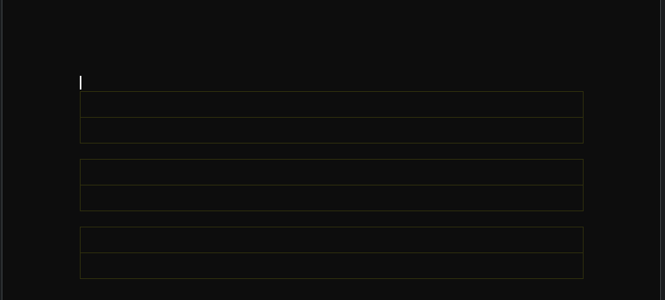
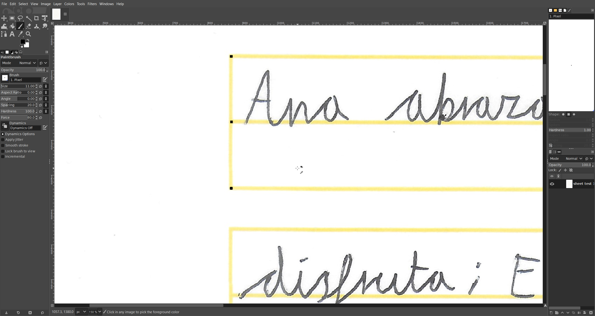
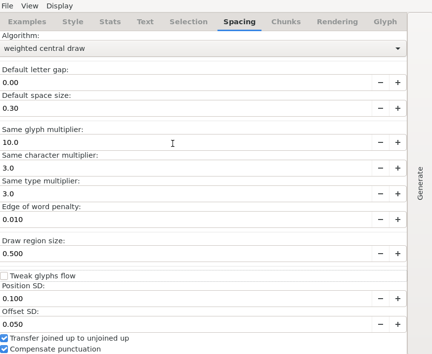
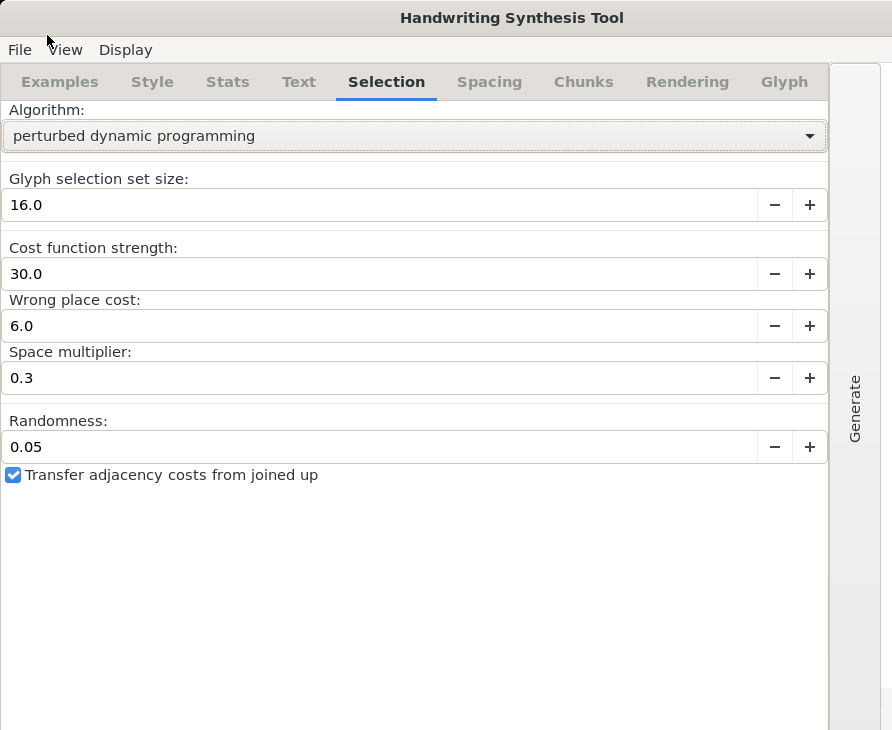
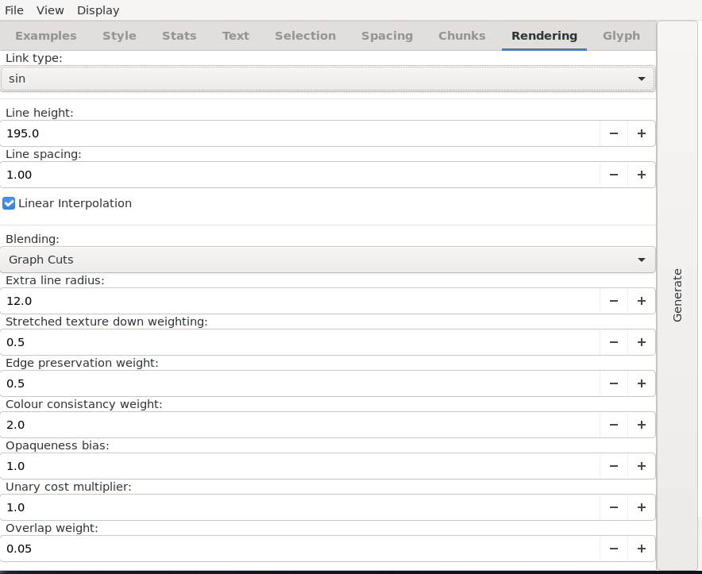
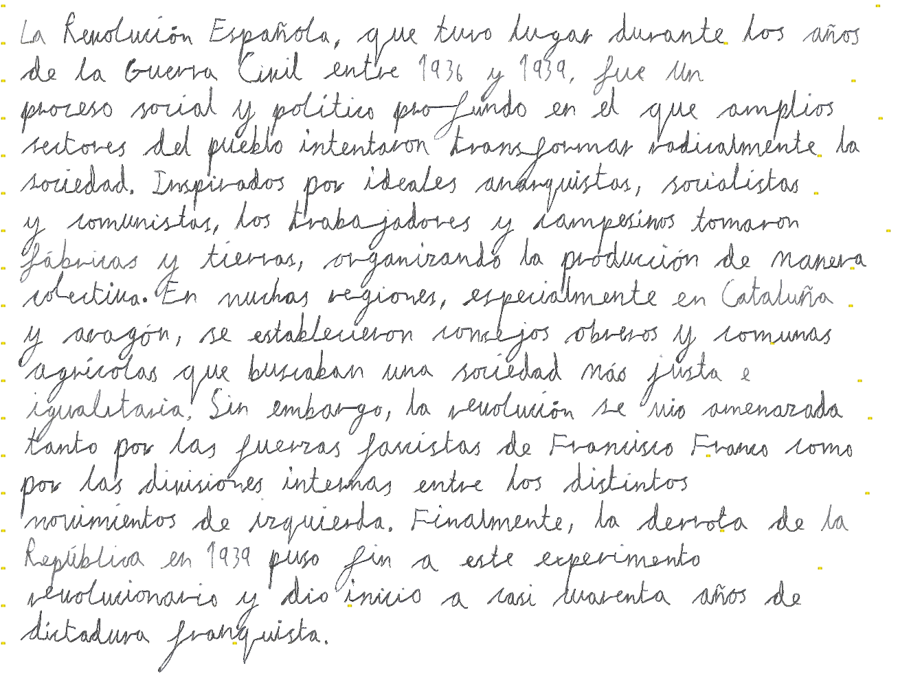
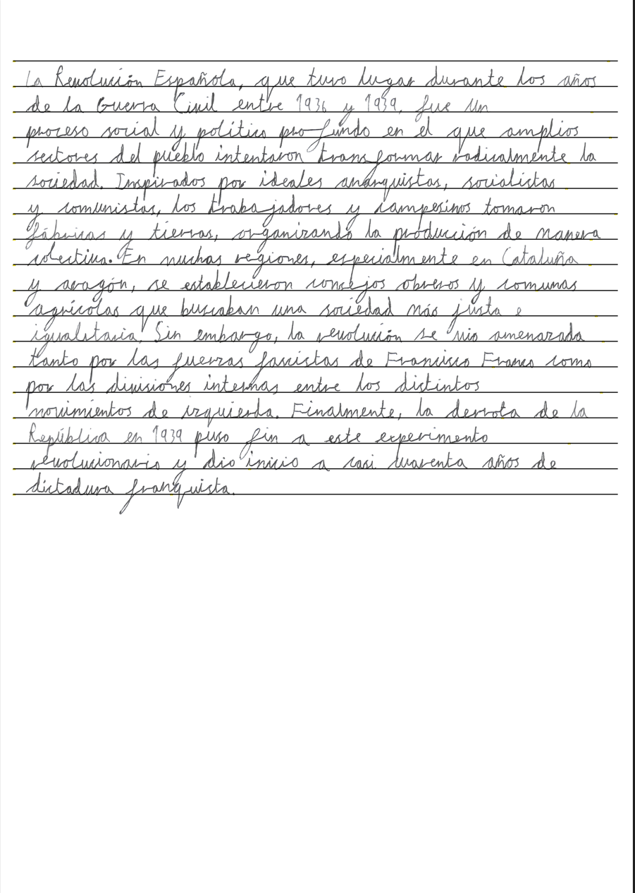

# Handwriting-formating-pipeline

An extension/pipeline to **“My Text in Your Handwriting”** by Thaines. Includes text formatting, limited Unicode→ASCII support, a print-formatting pipeline, and training-data processing macros/utils — plus a recommended training sheet.

> **Note:** This is **not** a full installation guide for the original project. For setup, see:
> [My Text in Your Handwriting (HELIT)](https://github.com/thaines/helit/tree/master/handwriting#my-text-in-your-handwriting)

---
## Demo Video

Watch a full demonstration of the handwriting formatting and synthesis pipeline:

🎥 **Demo Video:** [assets/2025-10-06 17-24-50.mp4](assets/2025-10-06 17-24-50.mp4)

> The demo walks through:
> - Formatting and synthesizing text  
> - Generating printable pages

---


## Quick tips (what worked for me)

1. **Ubuntu 20.04.6 LTS (WSL2)** — newer Ubuntu versions gave me issues with GTK/Python2 and inline C compilation.
2. **Python 2.7** runtime with:

   * `python-gi`, `gir1.2-gtk-3.0` (GTK bindings)
   * `python-cairo`
   * `python2-dev` / `python-dev`, `build-essential`
   * `numpy==1.16.6`, `scipy==0.19.1` (provides `scipy.weave`)
3. If you hit missing imports (`gi`, `cairo`, `weave`), install the packages above and re-run.
4. Use system Python 2 (not a Python 3 venv) for the **LET/HST** tools.

---

## Build notes & fixes

### Symptom

Running `python2 main.py` in `helit/handwriting/let` failed with:

```
ImportError: .../line_graph_c.so: undefined symbol: HalfToEdge
```

### Cause

`HalfToEdge` was defined **twice**:

* Correct, **inline** definition in
  `helit/handwriting/let/line_graph/line_graph_c.h`
* A **duplicate/conflicting** definition left in
  `helit/handwriting/let/line_graph/line_graph_c.c` (≈ line **5935**)

This duplicate caused compile/link/runtime symbol issues.

### Fix (single source change)

**Remove** the duplicate from `line_graph_c.c` and rely on the header’s inline version.

**Before** (❌ in `.c`, around ~5935):

```c
// line_graph_c.c — this should NOT exist here
Edge * HalfToEdge(HalfEdge * half) {
    return half ? half->edge : NULL;
}
```

**After** (✅ keep only in `.h`):

```c
// line_graph_c.h — canonical definition
inline Edge * HalfToEdge(HalfEdge * half)
{
    if (half->reverse < half) half = half->reverse;
    return (Edge*)(void*)((char*)(void*)half - offsetof(Edge, pos));
}
```

### Result

* `LET` (Line Extraction & Tagging) launches and runs on **Ubuntu 20.04.6 LTS** with **Python 2.7**.
* No other source edits were needed beyond removing the duplicate function.

---
## Pipeline (end-to-end)

1. **Write & Scan**
   - Handwrite samples on the training paper.
   - Scan the pages (recommended: 300–600 DPI).

2. **Clean Scans**
   - Open scans in **GIMP** (or similar).
   - add guide dots 
   -  Run Remove yellow filter 2x minimum
   

3. **Split Training Data**
   - Use the **Training Data Splitter** to cut pages into line/word samples.
   - Save outputs into a working directory, e.g.:
     ```
     ubuntu:/example/training-data/
     ```

4. **Launch Tagging GUI**
   - Open the **Tagging GUI** and **annotate** the split samples.

5. **Format Target Text**
   - Open the **Text Formatter**.
   - Format the text you want to generate

6. **Synthesis GUI**
   - Open the **Synthesis GUI**.
   - **Paste** the formatted text.
   - **Load** LineGraph and related models/resources.
   - **Run** synthesis and **save** the output images.

7. **Make Printable Sheets**
   - Import the synthesized images into the **Image → Printable** GUI.
   - Generate printable pages (with guide lines).
   - **Print** the final output.
---
## Training Paper

- The paper is **lined** and printed in **yellow** so the *Remove Yellow Lines* filter can cleanly erase the guides after scanning.
- **Download:**  
  - Google Doc: <https://docs.google.com/document/d/1u1kvDfMi5yQU8kDDmUCosf0y4eZML-CktD-G0D4UOqk/edit?usp=sharing>  
  - Or use the copy included in this repo.

> Print at 100% scale on Letter/A4.



---
## Cutting & Processing Raw Data

1. **Open Scanned Sheet**
   - Open your scanned training sheet in an image editor (e.g., **GIMP**).
   - Recommended scan: 300–600 DPI, full color.

2. **Add Black Reference Dots**
   - Place **small black dots** at both ends of each yellow line.
   - These dots serve as reference points after the yellow lines are removed.

3. **Remove Yellow Lines**
   - Run the **“Remove Yellow Lines”** filter **twice**.
   - This clears the guide lines while keeping your handwriting intact.

4. **Run the Macro Cutter**
   - Launch the macro i provided note(name and counter have to be configured in python file)
   - **Cut every two yellow boxes** — each cut should contain **one full line of written text**.
   - Make sure the **black reference dots remain** in the cropped images (used later for alignment).

5. **Export and Import**
   - Save all processed line images.
   - Import the resulting dataset into your **Ubuntu environment** for tagging and training.

### Example



---
## Annotating (how I did it)

> I couldn’t follow the YouTube walkthrough from Thaines at first and burned ~30 lines of data. Here’s the approach that finally worked for me.

- **Leading underscores for spaced-onset letters**
  - If a letter begins **after a space**, add a **leading underscore** before that letter **and** keep the **entire cursive connector** on the **front** of the letter (but **not** the back).
  - Example (word start and word end):  
    `marton` → `_marton_`

- **Word-final handling**
  - Mirror the rule at the end of the word: keep the trailing connector fully with the **ending** letter, then add an **underscore** after it (see example above).

- **Capitals**
  - Capitals only work well **if they’re connected** to the rest of the word by the baseline/connector.
  - Practical tip: *write your capitals in cursive* so the **M** (for example) connects to the rest of `arton`. Otherwise the model has trouble learning the glyph transitions.

- **Manual vs. auto-annotate**
  - I **don’t recommend** the auto-annotate for this setup. It likely works for some, but I got better quality by doing it **manually** and keeping a smaller, higher-quality glyph set.

- **What this yielded for me**
  - After **25 hours** of manual annotation (~**100–120 LineGraphs**, including capitals, letters, and symbols), my dataset could generate in **Spanish, English, Catalan, and French**.

---

## Text Formatter & Image→Printable (notes)

- These tools are tuned to **what worked for my handwriting**. You may need to adjust:
  - In the **Synthesis GUI**: **line height** and related attributes.
  - In the **Text Formatter** script: **desired letters/words per line**.
- Don’t be surprised if your outputs look off initially—tweak spacing and line metrics to match your writing size.

---

## Notes on Letter/Unicode Support

- Currently the pipeline supports **ASCII only** (no direct Unicode), so characters like **à** aren’t natively handled.
- Temporary workaround: I use a **mapping key** that substitutes ASCII symbols for those letters during formatting.
- Future plan: contribute common accented-letter support (e.g., **à/á/è/é/ñ/ç**) upstream in the main project.
---

## Example: Before vs. After Processing

### Current Settings


  
  


---

### Before
*(Example of a text generated )*



---

### After
*(text with added lines and formated)*




